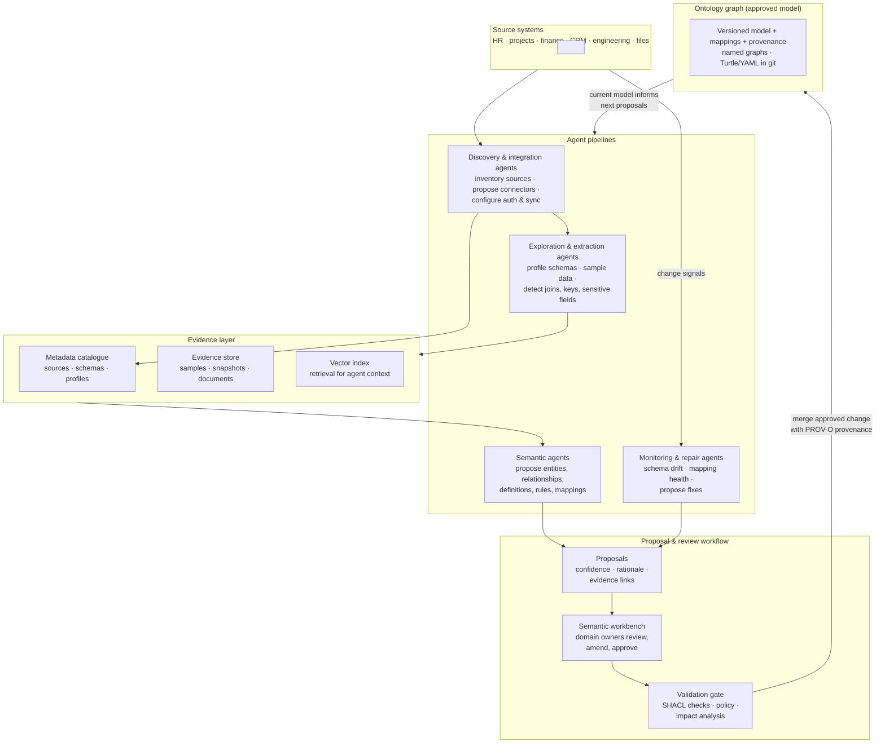
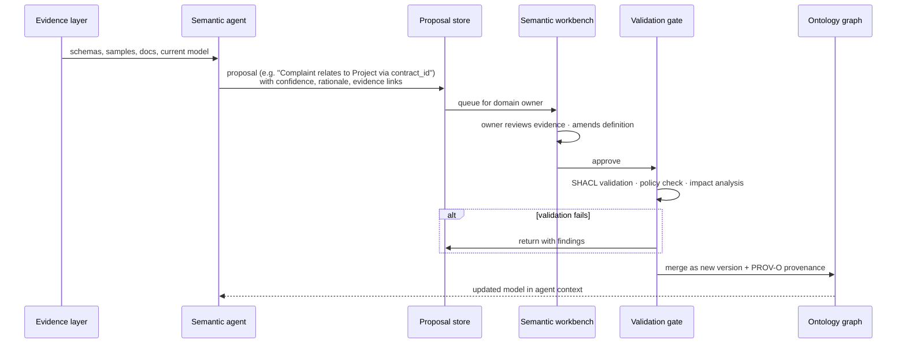

# Build-time Architecture

The build-time view of Ontolox: how agent pipelines discover sources, gather evidence, and construct the ontology through proposals that people review and approve. Build-time *changes* the model; the [runtime](./runtime-architecture.md) *uses* it. The two meet at the ontology graph.

Related docs: [standards.md](./standards.md) (formats agents emit) · [storage.md](./storage.md) (stores) · [runtime-architecture.md](./runtime-architecture.md).

## Overview

Build-time is a continuous loop, not a one-time implementation:

1. **Discover and connect:** discovery agents inventory databases, APIs, SaaS apps, and file stores; integration agents propose connector configurations, which pass human approval gates for credentials and sensitive access before going live.
2. **Explore and collect evidence:** exploration agents profile schemas, sample records, assess quality, and detect keys, joins, and sensitive fields. Everything lands in the evidence layer — catalogue records, raw snapshots, and embeddings for retrieval.
3. **Propose semantics:** semantic agents translate evidence into proposals — entities, relationships, definitions, rules, and mappings to source fields — each with confidence, rationale, and links back to the evidence that supports it. Conflicting concepts across systems are surfaced, not silently flattened.
4. **Review and approve:** domain owners work in the semantic workbench: accept, amend, or reject proposals. A validation gate runs SHACL checks, policy checks, and impact analysis against the current model before anything merges.
5. **Version and learn:** approved changes merge into the ontology graph as a new version — named graphs in the store, Turtle/YAML diffs in git — with full PROV-O provenance. The updated model feeds back into agent context for the next round.
6. **Monitor and repair:** monitoring agents watch for schema drift, failing integrations, and mapping degradation, and raise repair proposals through the same review workflow. Low-risk changes can auto-apply within policy; anything touching regulated definitions or production writes requires explicit review.

## A semantic proposal, end to end

Rejected or failed proposals return to the agents with the reviewer's findings — feedback is training signal, not a dead end.

## Approval boundaries

Automation is bounded by governance. Indicative policy defaults:

| Change type | Handling |
|---|---|
| Metadata enrichment, descriptions, low-risk profiling | Auto-apply, logged |
| New entities, relationships, definitions, mappings | Domain-owner approval in workbench |
| Connector credentials, production source access | Explicit technical-owner approval |
| Regulated definitions, financial/people/customer data, action contracts | Named approver + tighter policy, full audit |

## Build-time components and technology

| Component | Role at build time | First-version technology |
|---|---|---|
| Agent pipelines | Discovery, exploration, semantic modelling, monitoring | Python agents (LLM-driven), emitting RDF/SHACL or LinkML YAML fragments |
| Metadata catalogue | Source and schema inventory, profiles, contracts | PostgreSQL (DCAT export) |
| Evidence store | Samples, snapshots, documents | MinIO, content-addressed |
| Vector index | Agent retrieval over evidence and definitions | pgvector |
| Proposal store | Proposals, confidence, review state | PostgreSQL |
| Semantic workbench | Human review, amendment, approval | Web app over proposal store + graph |
| Validation gate | SHACL, policy, impact analysis before merge | pySHACL + policy-as-code (OPA/Cedar) |
| Ontology graph | Versioned approved model | Apache Jena Fuseki + git (Turtle/YAML); see [storage.md](./storage.md) |
| Pipeline lineage | Run-level events from agent and extraction jobs | OpenLineage events in PostgreSQL |

Build-time and runtime share infrastructure (graph, Postgres, MinIO, secrets) but differ in authority: build-time agents may only *propose*; the validation gate and human approval are the sole paths by which the model that runtime trusts ever changes.
