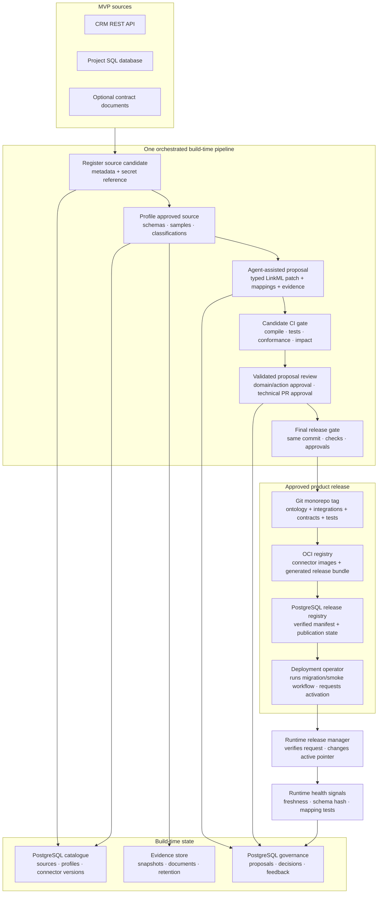

# Build-time Architecture

The build-time view of Ontolox: how source evidence becomes an approved, immutable model release. Build time may *propose and release* model changes; the [runtime](./runtime-architecture.md) may only *activate and use* a validated release. They meet at the active model-release contract, not through shared ad-hoc graph mutation.

Related docs: [artifact-management.md](./artifact-management.md) (Git/OCI/release ownership) · [standards.md](./standards.md) (authoring and exports) · [storage.md](./storage.md) (systems of record) · [runtime-architecture.md](./runtime-architecture.md) (release consumption).

## MVP design decisions

- The MVP implements one orchestrated pipeline with discovery, profiling, proposal, candidate validation, review/approval, and release stages. These are logical capabilities, not independently deployed autonomous agent systems.
- One **Git monorepo is canonical for ontology and integration source**: LinkML, connector/action-adapter code, mappings, contracts, migrations, and tests. Agents emit JSON-Schema-constrained proposals and isolated-branch patches.
- Deterministic CI generates RDF/OWL, SHACL, JSON-LD, JSON Schema, provenance, connector images, and release reports. It publishes these immutable outputs to an OCI-compatible registry; generated artefacts are not edited as parallel Git sources.
- Every change to the runtime-trusted model, mapping, identity rule, operational contract, or action contract requires validation and an accountable human approval.
- Only non-authoritative catalogue facts—such as a new profile run or freshness observation—may be stored automatically. They cannot alter an active model release.
- Build time owns discovery, evidence, proposals, and release. Runtime owns connector execution, materialisation, queries, actions, and operational health signals.

## Overview



## Lifecycle and ownership

1. **Register a source candidate.** A platform owner records source type, owner, classification, endpoint metadata, and a reference to a secret. Agents never receive or persist secret values.
2. **Approve technical access.** A technical owner approves the least-privilege account, sampling limits, retention, and intended read/write capabilities before a connector can touch production.
3. **Profile and collect evidence.** Runtime executes the approved connector in profile mode; build time stores schema metadata, bounded samples, quality findings, candidate keys, and classifications.
4. **Propose a coherent change.** The workbench creates a governance proposal and a release bot opens an isolated Git branch spanning the model, integration code, mappings, identity rules, migrations, tests, and relevant contracts. Confidence is advisory; evidence and tests determine trust.
5. **Validate a candidate release.** CI scans the repository, tests connector and migration code, compiles required ontology artefacts, checks the supported LinkML profile, validates positive/negative examples, detects breaking changes, and replays the MVP golden query/action tests.
6. **Review the validated commit.** A domain owner reviews business meaning and identity in the workbench; technical code owners review the pull request; a named action owner reviews write contracts. Formal approvals bind to the exact CI-passing commit SHA. Any amendment invalidates approvals and returns the proposal to validation.
7. **Publish, migrate, then activate.** A protected merge creates an immutable SemVer Git tag. CI publishes digest-addressed connector images and a generated release bundle to the OCI registry; the release publisher records the verified manifest in PostgreSQL. A named deployment operator starts the isolated migration runner, verifies its recorded result and smoke tests, then requests production activation. The runtime release manager verifies prerequisites and atomically changes the active-version pointer.
8. **Observe and propose repair.** Runtime publishes freshness, schema hashes, connector failures, identity ambiguities, and mapping-test results. Build time may create a repair proposal; the MVP does not autonomously change production mappings.

The governance proposal is authoritative for domain/data/action approval; the Git pull request is authoritative for the reviewed source diff and technical checks. A release requires both. See [artifact-management.md](./artifact-management.md) for the complete branch, CI, build, and publication flow.

## Promotion contracts

Each promoted artefact has one owner and an explicit handoff:

| Artefact | Build-time responsibility | Runtime responsibility |
| --- | --- | --- |
| Connector/action-adapter source and reusable template | Propose and review code, capabilities, defaults, tests, and classifications in Git; build/publish OCI image | Pull the exact image digest pinned by the active release |
| Environment connector binding | Define allowed fields, schedule constraints, owner, endpoint shape, and secret-reference requirements | Store tenant/environment values and secret references in PostgreSQL; report health/schema hash |
| Mapping contract | Propose source-to-model transform, errors, identity and lineage rules | Execute exactly the active version |
| Identity contract | Define canonical key, IRI construction, ambiguity policy | Resolve exact keys; quarantine missing/ambiguous matches |
| Operational contract | Define mode, freshness, quality, access, retention, owner | Materialise/fetch and enforce the contract |
| Action contract | Define JSON Schema, adapter, policy, approval, idempotency, concurrency | Validate and execute approved requests |
| Model release | Compile, validate, approve, and publish immutable manifest | On an operator request, verify compatibility, atomically activate, pin operations, and support rollback |

## A semantic proposal, end to end

```mermaid
sequenceDiagram
    participant E as Evidence and current release
    participant A as Proposal agent
    participant P as Proposal store
    participant G as Git forge
    participant W as Workbench
    participant V as Release gate
    participant O as OCI registry
    participant M as PostgreSQL release registry
    participant D as Deployment operator
    participant R as Runtime

    E->>A: approved schemas, bounded samples, docs, current model
    A->>P: typed patch + confidence + rationale + evidence + tests
    P->>G: release bot opens isolated branch + pull request
    G->>G: CI scans, tests, generates and validates candidate
    alt validation fails
        G->>P: structured findings; state returns to in_review
    else validation succeeds
        G->>W: CI-passing commit + ontology/mapping/evidence diff
        W->>P: domain/data/action approvals bound to commit SHA
        G->>G: technical code-owner approval of same commit
        P->>V: governance approvals
        G->>V: passing CI checks + technical approval
        V->>V: verify checks and approvals reference identical commit
        V->>G: protected merge + SemVer tag
        G->>O: CI publishes connector images + generated release bundle
        G->>M: release publisher writes verified manifest with Git/OCI digests
        M-->>D: published release ready for deployment
        D->>R: request activation after migration/smoke checks
        R->>M: verify manifest, approvals and compatibility
        R->>O: verify/pull bundle and image digests
        R->>R: atomically change active-version pointer
        R-->>P: activation outcome and health signals
    end
```

Rejected or failed proposals retain the reviewer's findings and may inform later agent evaluation. They never become part of the active model.

## Proposal and release states

- Proposal accepted path: `draft → queued → in_review → validated → approved → released`.
- Proposal declined path: `draft/queued/in_review/validated → rejected`; `rejected`, `withdrawn`, and `superseded` are terminal.
- A source amendment after `validated` or `approved` returns the proposal to `in_review`, expires prior approvals, and requires CI plus review against the new commit.
- Connector: a technical owner moves `candidate → access_approved`; runtime deploys `profile_only`; after profile and contract review the technical owner marks `runtime_approved`; runtime then records `deployed`, `suspended`, or `retired`.
- Release: build time moves `candidate → validated → published`; a named deployment operator requests `active`; runtime records activation, `superseded`, or `rolled_back` deployment status separately from proposal state.

Every transition records actor, timestamp, reason, previous state, and content digest.

## Approval boundaries

| Change type | MVP handling |
| --- | --- |
| Profile results, freshness observations, schema hashes | Store automatically as non-authoritative evidence; logged and retention-bound |
| Descriptions or classifications in the active model | Domain-owner approval |
| Entities, relationships, definitions, mappings, identity or operational contracts | Domain owner + relevant technical owner |
| Connector production access or secret-reference change | Explicit technical owner |
| Customer/hr/financial semantics and access classifications | Named data owner |
| Action contract or write-capable connector | Named action owner + technical owner; full audit |

There is no model auto-apply path in the MVP. Policy-bounded automatic release may be reconsidered only after proposal quality and rollback are measured in production.

## Validation and impact analysis

The release gate performs:

1. Secret/private-key/sensitive-sample scanning and required source formatting, linting, type, unit, and dependency checks.
2. LinkML syntax and supported-profile validation.
3. Deterministic generation and parsing of required RDF/OWL, SHACL, JSON-LD, JSON Schema, provenance, and runtime projections.
4. Stable-IRI, exact identity-key, mapping completeness, and classification checks.
5. Positive and negative examples proving equivalent runtime and generated-SHACL outcomes.
6. Connector sandbox/contract tests and PostgreSQL migration compatibility/rollback checks.
7. Breaking-change analysis over model, integrations, mappings, operational contracts, and action inputs.
8. Replay of the versioned complaint-resolution golden query.
9. Action-contract simulation, idempotency tests, and verification that approval is bound to the exact payload and model version.
10. OCI image/bundle build, vulnerability scan, SBOM/build provenance, and reproducible content-digest checks.
11. Required governance approvals, technical code-owner reviews, and protected-branch checks bound to the candidate commit.

For the MVP, “impact analysis” means the affected entities, mappings, read model, query contract, action contract, and migration/rollback requirements. General graph-wide impact inference is deferred.

## Build-time components and technology

| Component | MVP role | First-version technology |
| --- | --- | --- |
| Pipeline orchestrator | Run discovery/profile/proposal/validation jobs | Python jobs with durable state in PostgreSQL |
| Proposal agent | Produce typed candidate patches, rationale, evidence links, and tests | LLM-driven Python component constrained by JSON Schema |
| Metadata catalogue | Source inventory, schemas, profiles, classifications, connector versions | PostgreSQL; DCAT export |
| Evidence store | Bounded samples, snapshots, and documents | S3-compatible storage only when required by the slice |
| Proposal/governance store | Proposals, review state, approvals, feedback, activation outcome | PostgreSQL |
| Semantic workbench | Proposal inbox, evidence/diff view, constrained editing, approval | Web app over governance APIs; not an RDF graph editor |
| Release gate | Compilation, conformance, impact and golden tests | LinkML toolchain, JSON Schema validator, RDFLib/pySHACL, application tests |
| Source repository and forge | Ontology/integration source, pull requests, technical review, protected tags, CI status | Git monorepo on the chosen forge |
| Build artefact registry | Connector/action images, generated ontology bundle, SBOM and build provenance | OCI-compatible registry, addressed by digest |
| Published release registry | Verified manifest and publication state | PostgreSQL; build-time release publisher may insert immutable records |
| Migration runner | Apply the exact published migration set before activation and record outcome | Isolated release job using the OCI bundle; deployment operator starts it |
| Activation registry | Active pointer and activation/rollback history | PostgreSQL; runtime release manager is the sole writer |
| Lineage and audit | Build jobs, evidence, decisions, release linkage | PostgreSQL; PROV-O export |

Vector retrieval is added only if evaluation shows it improves proposal quality over direct schema/document context. OPA/Cedar, OpenLineage, Fuseki, and autonomous repair are not required by the MVP build-time path.
