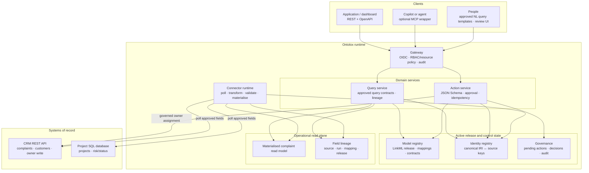
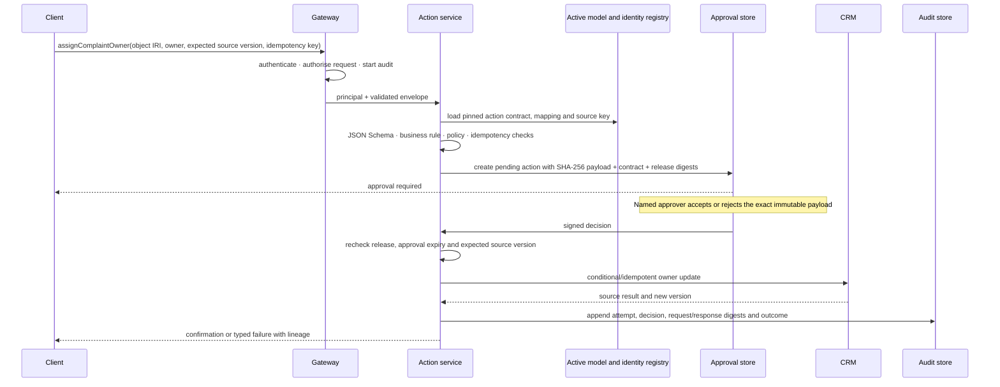

# Runtime Architecture

The runtime view of Ontolox: how an immutable model release governs ingestion, a cross-system read, and one safe write-back. The MVP proves the complaint-resolution slice against a CRM REST API and a project SQL database.

Related docs: [artifact-management.md](./artifact-management.md) (source/build/runtime artefacts) · [standards.md](./standards.md) (protocols and formats) · [storage.md](./storage.md) (systems of record) · [buildtime-architecture.md](./buildtime-architecture.md) (how releases are built).

## MVP boundaries

- PostgreSQL is the runtime model registry, identity registry, materialised read store, lineage store, governance store, and audit store.
- The complete complaint-resolution read path is materialised and deterministic. Live federation and runtime caches are not enabled in the MVP.
- REST/OpenAPI is the service contract. MCP may be a thin wrapper over the same operations; GraphQL, GQL, arbitrary SPARQL, and a general natural-language planner are deferred.
- A natural-language UI may select and parameterise approved query templates; it may not invent unrestricted source queries or writes.
- Runtime never edits the ontology model. It atomically activates a validated release and pins that version on every ingestion run, query, and action.

## Overview

## The active model release

Runtime reads one immutable release manifest containing:

- Git repository, commit SHA, and protected SemVer tag;
- generated OCI release-bundle digest and connector/action-adapter image digests;
- LinkML model version and generated-artefact digests;
- source mappings and transformations;
- exact identity keys and IRI construction rules;
- operational contracts: access mode, freshness, quality, classification, retention, and owner;
- query contracts and response schemas;
- action contracts and target adapter versions;
- migration/toolchain digests, compatibility, activation prerequisites, and rollback metadata.

The build-time release publisher may create an immutable manifest but cannot activate it. A named deployment operator starts an isolated runner that applies only the manifest-listed migrations and records their digests/results, runs smoke checks, then requests production activation. The runtime release manager verifies governance approvals, the Git commit/tag, OCI bundle/image digests, migration/smoke records, and compatibility, loads versioned projections, then transactionally changes the active pointer; it is the sole writer of that pointer. The migration runner cannot change the pointer. In-flight operations finish on the release they started with. A breaking release requires a migrated read model or a versioned parallel read path before activation.

## Runtime artefact boundary

Runtime does not execute source code from a Git checkout or build containers during deployment:

- the release manager reads the verified manifest and active pointer from PostgreSQL;
- the deployment system pulls connector/action images by immutable OCI digest;
- model, mapping, identity, query, and action projections in PostgreSQL are loaded only from the verified OCI release bundle;
- endpoint, tenant, schedule, enabled-field, and secret-reference bindings come from PostgreSQL;
- secret values are resolved directly from the deployment secret manager;
- checkpoints, leases, retries, quarantine, and reconciliation remain PostgreSQL runtime state.

This boundary allows Git and the build registry to be unavailable during normal queries/actions after an activation, while preserving a complete digest chain back to reviewed source. See [artifact-management.md](./artifact-management.md).

## Runtime loops and ownership

1. **Synchronise.** Runtime connectors poll only approved fields; execute versioned transforms; validate the normalised JSON record, identity, quality rules, and relational constraints; then upsert the materialised complaint slice. Each field records source key/version, extraction run, mapping, and model release. Invalid or ambiguous records are quarantined with typed findings.
2. **Query.** The query service executes a named, versioned query contract against the materialised read model, applies field/relationship access policy, and returns data plus structured lineage and freshness.
3. **Act.** The action service resolves the canonical object to its source key, validates the exact request, obtains approval where required, performs one idempotent write to the CRM, and appends the result. The next sync reconciles the local read model.
4. **Observe.** Runtime records freshness, schema hashes, mapping tests, identity ambiguities, connector failures, query latency, and action reconciliation. It sends signals to build time; it does not repair the active model autonomously.

Build time proposes and approves connector definitions; runtime deploys their approved versions and owns availability. Profiling is a build-time purpose executed through the same connector runtime in a bounded `profile_only` mode.

## Identity resolution

The MVP uses deterministic exact matching:

- CRM complaint/customer IDs identify CRM records.
- Project code is the declared cross-system project key.
- The CRM active-user directory is the MVP source of truth for assignable owners. CRM user ID is the immutable owner key and CRM write value; display name/email are attributes only. A project accountable owner is informational unless explicitly mapped to an active CRM user.
- A canonical IRI resolves through the identity registry to one or more source keys.
- Missing, duplicate, or conflicting keys produce a quarantined record and a review signal, never a guessed join.

Probabilistic matching is out of scope. Query responses report excluded ambiguous records so apparently complete answers are not misleading.

The preferred complaint→project join is a structured project code carried by the CRM complaint. If profiling proves that field is absent, the only MVP fallback is a versioned structured crosswalk from CRM contract/customer reference to project code, with an accountable owner and ambiguity checks. Document extraction is evidence for a proposal, not a runtime identity path. A release cannot activate until one join path passes the golden dataset.

## Runtime instance validation

The release compiler produces the normalised-record JSON Schema and SQL constraint/migration artefacts from the supported LinkML profile. The sync transaction applies, in order:

1. connector envelope and source-version checks;
2. deterministic mapping/transformation with typed null/error behaviour;
3. normalised-record JSON Schema validation;
4. exact identity resolution and relationship-key checks;
5. operational-contract quality and classification rules;
6. PostgreSQL constraints and transactional upsert.

A failure writes the raw-reference, release/mapping version, and typed findings to quarantine; it does not partially update the trusted read model. Generated SHACL is used for release equivalence tests and to validate an RDF projection before publication, not as a hidden second runtime rule engine.

## Query contract and lineage

The initial read contract is:

> Which unresolved customer complaints relate to active or at-risk projects, and who currently owns each complaint?

Its implementation is a reviewed SQL/query-service contract over the materialised slice, not unrestricted LLM-generated SQL. Parameters, filters, ordering, access policy, response schema, and freshness expectations are versioned with the model release.

The canonical MVP predicates are:

- `unresolved complaint`: canonical status is `new`, `open`, `in_progress`, or `pending`;
- `active project`: canonical lifecycle status is `active`;
- `at-risk project`: canonical risk level is `amber` or `red`.

The mapping contract must map every relevant source value to these canonical enums, `other`, or `unknown`. A domain owner approves that mapping after profiling; unmapped values cannot silently satisfy a predicate.

Each returned field can be explained with:

| Lineage field | Meaning |
| --- | --- |
| `canonical_iri` | Stable Ontolox object identifier |
| `source_system` and `source_key` | Authoritative record |
| `source_version` or `observed_at` | Source state used |
| `extraction_run_id` | Poll/materialisation run |
| `mapping_id` and `mapping_version` | Transformation that produced the field |
| `model_release` | Active semantics used by the query |
| `freshness_at` | Latest successful observation |

An answer is not presented as complete when required sources are stale, unavailable, or contain unresolved identities. The response carries a status such as `complete`, `partial`, or `stale` with machine-readable reasons.

## Client types

| Client | MVP interface | Typical use |
| --- | --- | --- |
| Conventional application | REST/OpenAPI query and action endpoints | Complaint dashboard and owner assignment |
| AI agent or copilot | Optional MCP tools backed by the same endpoints | Explain a cited answer; request, but not bypass, an approved action |
| Person | Query-template UI and governance UI | Ask the approved question, inspect lineage, review model proposals or pending actions |

Model-proposal approval and action approval may share one web shell, but they are different object types with different stores, permissions, and state machines.

OIDC authenticates users, clients, and service identities through appropriate flows. The policy framework is shared, but delegated-user permissions and connector service permissions are evaluated separately. MVP authorisation uses explicit roles and resource/field classifications; add one policy engine later only when tested rules exceed this model.

## A governed action, end to end

Approval is invalid if the payload, action contract, model release, target source record, or expected source version changes. A modified request creates a new pending action.

## Action reliability

- The client supplies an idempotency key; Ontolox stores its terminal outcome and returns it on safe replay.
- The adapter uses source-native idempotency or conditional update/version semantics where available.
- A timeout after sending a write becomes `reconciliation_required`, not an automatic blind retry.
- Source conflicts return a typed stale-version error and require a fresh request/approval.
- Local materialised data is not updated optimistically as authoritative; the source result is recorded and normal sync reconciles the read model.
- Secrets are resolved inside the connector/action adapter from the deployment secret manager and are never exposed to an agent or client.

Action paths are:

- executed: `requested → validated → pending_approval → approved → executing → succeeded/failed/reconciliation_required`;
- declined: `pending_approval → rejected`;
- abandoned: `pending_approval → expired`.

`rejected` and `expired` are terminal; reconciliation resolves to `succeeded` or `failed` with a new audit transition. Every transition is append-only and tied to principal, release, contract, payload digest, and timestamp.

## Runtime components and technology

| Component | MVP role | First-version technology |
| --- | --- | --- |
| Gateway | OIDC authentication, RBAC/resource checks, rate limits, request audit | Python web service integrated with an existing OIDC provider |
| Query service | Named query contracts, policy filtering, completeness and lineage | Python + parameterised SQL over PostgreSQL |
| Action service | Contract validation, approvals, idempotency, concurrency, adapter execution | Python + JSON Schema + PostgreSQL state machine |
| Model/identity registry | Active release, mappings, contracts, source-key resolution | PostgreSQL projections loaded from the verified OCI bundle |
| Read model | Materialised complaint/project/customer/owner slice | PostgreSQL tables or materialised views |
| Connector runtime | Profile mode, polling, transforms, validation, freshness/schema signals | OCI images pinned by digest; environment bindings and durable state in PostgreSQL |
| Governance and audit | Pending actions, decisions, attempts, outcomes | PostgreSQL with restricted append-only audit roles |
| Secrets | Runtime connector/action credentials | Deployment-provided secret manager; secret references in contracts |

No Fuseki, Valkey, OpenBao, OpenLineage deployment, GraphQL service, or policy engine is required for the MVP. Each can be added later against a measured requirement without changing the external query/action contracts.

The build-time pipeline and runtime share PostgreSQL schemas, the OCI registry, object storage when needed, and deployment identity/secrets infrastructure, but not authority. They meet only through immutable release manifests, content digests, and operational health signals—see [buildtime-architecture.md](./buildtime-architecture.md).
