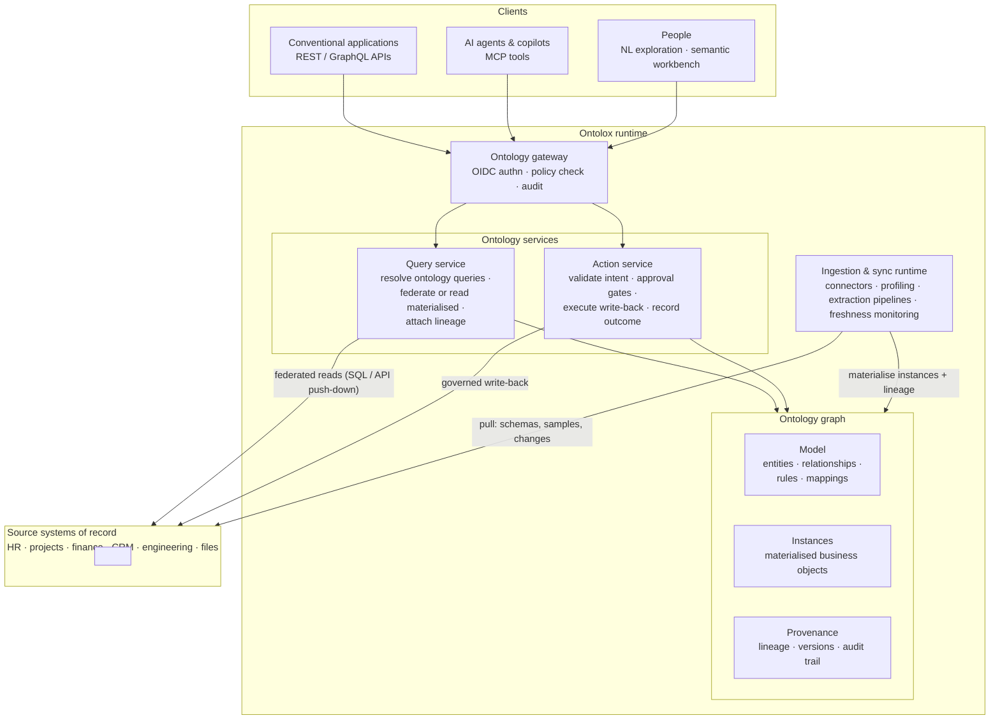
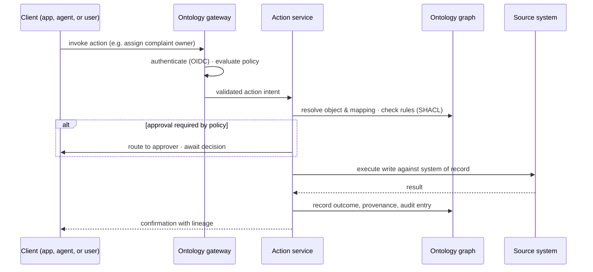

# Runtime Architecture

The runtime view of Ontolox: how data flows from source systems into the ontology graph, and how clients — conventional applications, AI agents, and people — query the ontology and perform governed actions through it.

Related docs: [standards.md](./standards.md) (protocols and formats) · [storage.md](./storage.md) (stores and engines) · [buildtime-architecture.md](./buildtime-architecture.md) (how the model is built).

## Overview

Three runtime loops share the same graph:

1. **Ingestion (data in):** connectors pull schemas, samples, and changed records from source systems; pipelines apply the approved mappings and materialise instances into the ontology graph — or merely refresh freshness signals for federated properties. Every load carries lineage.
2. **Query (read out):** clients ask business-level questions against the ontology model. The query service resolves each property through its mapping — served from materialised instances, TTL-bound cache, or live push-down to the source — and returns answers with source lineage attached.
3. **Action (write back):** clients invoke approved actions on ontology objects. The action service validates the intent against rules and policy, applies approval gates where required, executes the change against the correct system of record, and records the outcome and audit trail in the graph.

## Client types

| Client | Interface | Typical runtime use |
|---|---|---|
| Conventional applications | REST (OpenAPI) / GraphQL over ontology objects | Dashboards, internal tools, integrations reading business objects and invoking approved actions |
| AI agents & copilots | MCP tools (query, explain, act) | Grounded answers with lineage; policy-bounded task execution |
| People | NL exploration UI, semantic workbench | Cross-system questions; reviewing and approving model proposals and pending actions |

All three enter through the same gateway: OIDC authentication, policy evaluation (who may read which objects, invoke which actions), and audit logging apply identically regardless of client type.

## A governed action, end to end

Reads follow the same shape without the approval and write steps: gateway → query service → mapping resolution (graph, cache, or federated push-down) → answer with lineage.

## Runtime components and technology

| Component | Role at runtime | First-version technology |
|---|---|---|
| Ontology gateway | Authn/authz, policy, audit for every request | OIDC provider + policy-as-code (OPA/Cedar) |
| Query service | Ontology query resolution, federation, lineage | Python services; SPARQL to graph, SQL/API push-down to sources |
| Action service | Intent validation, approvals, write-back execution | Python services; JSON Schema action contracts |
| Ontology graph | Model, instances, provenance | Apache Jena Fuseki (SPARQL HTTP); see [storage.md](./storage.md) |
| Ingestion & sync runtime | Connectors, pipelines, freshness monitoring | Connector containers; state in PostgreSQL; evidence in MinIO |
| Cache | TTL-bound federated results | Valkey |
| Secrets | Connector credentials at runtime | OpenBao |

The build-time agent pipelines (discovery, exploration, semantic modelling) run on the same infrastructure but are a separate concern: they *change* the model through proposals and approvals, while this runtime view *uses* the approved model. The two meet at the ontology graph — see [buildtime-architecture.md](./buildtime-architecture.md).
