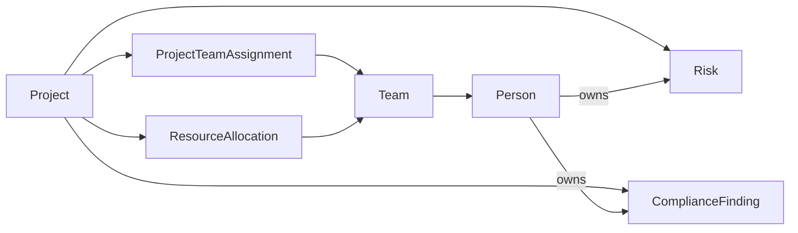

# 99x MVP Scope — Project Delivery Assurance

## Purpose

99x is the first design partner and proving ground. The MVP proves one complete, trustworthy loop:

> **Project, team, audit, risk, and resource-allocation data → evidence-backed ontology proposal → approved release → cross-domain delivery-assurance answer with field lineage → governed risk-owner assignment**

The MVP succeeds when 99x can identify active projects needing attention, explain why using current evidence, show the accountable teams/people, and safely assign an owner to an open material risk. It does not attempt to model all 99x operations.

## Primary users

- A delivery or portfolio owner who needs a current view of project assurance.
- A project/team lead who needs risks, compliance findings, and capacity constraints in context.
- An audit/compliance owner who validates compliance meaning and finding status.
- A resource manager who validates allocation semantics and coverage.
- A platform/data owner who approves source access, mappings, identity keys, and runtime health.
- An application or AI-agent builder who consumes the governed query/action contracts.

## Selected vertical slice

### Business objects

| Object | MVP properties |
| --- | --- |
| **Project** | Source ID/project code, name, lifecycle status, start/end dates, accountable owner |
| **Team** | Source ID, name, active status, team lead |
| **Person** | Stable workforce ID, display name, active status; no payroll or sensitive HR attributes |
| **ProjectTeamAssignment** | Source assignment ID, or approved composite key; project, team, responsibility, effective dates |
| **Risk** | Source ID, project, category, likelihood, impact/rating, status, owner, review date |
| **ComplianceFinding** | Source ID, project, audit/control reference, status, severity, due date, owner |
| **ResourceAllocation** | Source ID, project, team, canonical month, requested FTE, committed FTE |

Only properties required by the read, action, policy, identity, or lineage acceptance tests enter the MVP ontology.

### Core ontology relationships

Reviewed LinkML in Git defines this semantic model. Generated representations are release artefacts; source applications remain authoritative for business records.

### Source roles

| Source role | MVP data | Access |
| --- | --- | --- |
| **Project portfolio source** | Projects, lifecycle status, dates, accountable owner, project-team assignments | Read-only |
| **Team/person directory** | Active people, teams, leads, and memberships | Read only; minimum approved fields |
| **Audit/compliance source** | Project findings, controls/audits, severity, due dates, owners | Read-only |
| **Risk register** | Project risks, ratings, state, review date, owner | Read approved fields; write risk owner only |
| **Resource-planning source** | Requested and committed FTE by project, team, and period | Read-only |
| **Evidence/document store** | Optional audit evidence referenced by findings | Bounded evidence access; not a mandatory runtime join |

One 99x system may satisfy several source roles. Record the actual products/endpoints, owners, rate limits, authentication, data classifications, and conditional-update/idempotency support before implementation. Reuse existing supported interfaces; do not build a generic connector abstraction first.

### Identity and join rules

- Project code is the declared cross-system project key.
- Each team and person uses the immutable identifier from the team/person directory. Email, display name, and team name are attributes, not keys.
- A project-team assignment uses its source assignment ID. If none exists, its canonical key is `(project code, team ID, responsibility, valid-from date)`; overlapping duplicate assignments are quarantined.
- Each risk, compliance finding, and resource allocation uses its source's immutable identifier.
- Project owner, project-team assignment, and allocation references must use the directory's team/person IDs or an approved crosswalk.
- Risk-owner and finding-owner user IDs each use a separate versioned crosswalk to the directory person ID. The risk-owner mapping must also preserve the risk register's active user ID used for writes.
- Every source identity maps to at most one active canonical person/team for an effective period. One-to-many or overlapping mappings are ambiguous and excluded.
- Project-team assignments and allocations are effective-dated.
- Every canonical object receives a stable IRI derived from tenant, object type, and canonical identifier.
- Missing, duplicate, or conflicting keys are quarantined and reported; the system never silently guesses a join.

Every risk, finding, assignment, and allocation must contain exact project/team/person keys or use an approved, versioned crosswalk with an owner, cardinality, effective dates, and ambiguity tests. If profiling cannot establish a reliable structured join, the affected source role is excluded and answer coverage is `partial`. Probabilistic matching, document-derived runtime joins, and unrestricted `owl:sameAs` reasoning are deferred.

## Scenarios

### Read

> **Which active 99x projects require attention because of material open risks, overdue or non-compliant audit findings, or resource-allocation gaps—and which teams and people are accountable?**

Canonical predicates are versioned in the query contract:

- active project = lifecycle status `active`;
- material risk = status `open` with approved canonical rating `high` or `critical`;
- compliance concern = an open finding that is overdue, non-compliant, or above the approved severity threshold;
- allocation gap = `max(0, Σ requested FTE − Σ committed FTE)` above the approved threshold for one `(project, team, canonical month)`; a project needs attention when any team has a material gap;
- accountable team/person = an active, effective-dated assignment or explicit source owner.

Allocations are normalised to FTE and half-open calendar months in the agreed 99x reporting timezone. Records spanning other periods are split using the approved source working calendar. If a source supplies both team summaries and person-level detail, the query uses the approved team summary and never sums both. Missing requested or committed capacity produces `unknown`, never an inferred shortage.

Profiling maps concrete source values to canonical enums, `other`, or `unknown`. Domain owners approve the mappings, working calendar, and allocation materiality threshold before release.

The answer must:

- use one versioned query contract over the materialised cross-source slice;
- return the project, attention reasons, relevant risk/finding/allocation values, and accountable teams/people;
- enforce object/field permissions and minimise person data;
- cite the source record/version, extraction run, mapping, and model release for every returned field;
- report per-source timestamps, independent coverage (`complete` or `partial`), and freshness (`current` or `stale`);
- surface unresolved identities, missing joins, and unavailable sources.

Natural-language exploration may only select and parameterise this approved query contract. Arbitrary LLM-generated SQL/API plans are out of scope.

### Write/action

> **Assign or change the owner of an open high/critical project risk in the risk register.**

The action must:

- accept a canonical risk IRI, approved person identifier, expected source version, and idempotency key;
- resolve the person to the risk register's active user key;
- validate the active action contract, JSON Schema, risk state/rating, identity mapping, business rules, and permissions;
- require a named approver to approve the exact immutable payload identified by a SHA-256 content digest;
- update only the owner field using source-native conditional update/idempotency where available;
- avoid duplicate writes on replay and blind retries after an uncertain timeout;
- record request, approval, execution, result, model/contract version, and reconciliation state.

A changed payload, source version, action contract, or model release requires new approval.

## Product principles

1. **Business meaning first.** Model only what the selected assurance result needs.
2. **Evidence over assertion.** Every proposal and mapping links to bounded source evidence and tests.
3. **Human authority, agent leverage.** Agents propose; accountable owners approve runtime-trusted changes.
4. **Materialise the proof; federate deliberately later.** Source systems remain authoritative while the narrow cross-system slice is materialised for reliability.
5. **Read and act through the same release.** Query and action contracts pin the same model, identity, and mapping version.
6. **Make failure visible.** Staleness, ambiguity, partial answers, conflicts, and uncertain writes are typed outcomes.
7. **Secure by construction.** Least privilege, data minimisation, retention, field policy, approvals, and audit are part of each contract.

## Included capabilities

- Read-only connectors for the existing 99x systems that satisfy the five source roles; co-located roles use one deployed connector.
- One bounded risk-owner action adapter.
- Bounded source registration, access approval, schema profiling, and sample analysis.
- One orchestrated agent-assisted pipeline that proposes LinkML model, mapping, identity, and contract patches.
- A proposal-inbox workbench with evidence, diffs, constrained amendment, and domain/technical approval.
- One Git monorepo containing LinkML, integration code, mappings, contracts, migrations, synthetic fixtures, and tests.
- An OCI registry containing digest-pinned connector images and generated release bundles: RDF/OWL, SHACL, JSON-LD, JSON Schema, provenance, reports, SBOM, and build provenance.
- PostgreSQL model/identity registry, materialised assurance read model, governance, field lineage, and append-only audit.
- REST/OpenAPI query and action endpoints; optional thin MCP wrappers.
- OIDC integration, explicit roles/resource classifications, and manual action approval.
- Poll-based synchronisation, freshness timestamps, schema hashes, mapping tests, and alerts.
- Agent evaluation based on proposal acceptance/correction, evidence completeness, invalid-output rate, and reviewer effort.
- Release activation and rollback through an immutable manifest and atomic active-version pointer.

## Explicitly deferred

- Project financials, timesheets, payroll, performance, sensitive HR data, skills inference, and individual productivity scoring.
- Client relations, complaints, sales, marketing, facilities, and broad executive reporting.
- Audit evidence interpretation as an authoritative compliance decision.
- Generic connector generation, a connector marketplace, and autonomous credential handling.
- Live runtime federation and runtime caches.
- General natural-language query planning, GraphQL, GQL, and arbitrary SPARQL.
- Automatic model/mapping release and agent-led production repair.
- Probabilistic entity resolution.
- Multi-step remediation workflows and source writes beyond risk-owner assignment.
- Fuseki/live OWL reasoning, property-graph projections, and large-scale operational graph materialisation.
- Valkey, dedicated vector infrastructure, OpenLineage deployment, OPA/Cedar, SCIM, Kafka, CDC, and CloudEvents unless an existing platform already supplies a required capability.
- Complex multi-region and multi-tenant governance.

## Acceptance gates

99x may revise these initial budgets once during source profiling with documented owner approval:

- materialised query latency: p95 ≤ 2 seconds at expected 99x volume;
- project, risk, and resource-allocation freshness: ≤ 4 hours during agreed business hours;
- team/person and audit/compliance freshness: ≤ 24 hours;
- post-approval risk-owner action response: ≤ 10 seconds while the risk source is available;
- source access to first candidate release: ≤ 5 working days after credentials, documentation, and source-owner answers are available;
- proposal batches: ≤ 20 semantic/mapping changes, with median active reviewer time ≤ 30 minutes after the baseline release.

The following correctness gates are non-negotiable:

### Connectivity and evidence

- Every required source role is bound to an approved least-privilege interface; unavailable roles are declared rather than hidden.
- Samples are classified, minimised, retention-bound, and never placed in agent context beyond policy.
- Connector source commit, OCI image digest, environment binding, schema hash, and source owner are recorded.
- No secret or identifiable source sample exists in Git, OCI release artefacts, CI logs, or test fixtures.

### Model and proposals

- The connector/action code, ontology objects/relationships, mappings, identity rules, migrations, query, and action contracts are reviewed and released from one candidate commit.
- Every accepted proposal element has rationale and resolvable evidence.
- Every release builds digest-pinned images and generates/parses the portable artefacts; outputs pass connector, migration, conformance, golden-query, action, vulnerability, and SBOM checks.
- Domain/governance approvals and technical pull-request reviews bind to the exact candidate commit SHA recorded in the release manifest.
- Breaking changes cannot activate without migration and rollback plans.

### Identity and read

- Every joined record follows a declared exact key; ambiguous records are never represented as resolved.
- A versioned, de-identified golden dataset covers: a high-risk project, overdue compliance finding, material allocation gap, multiple attention reasons, healthy/inactive exclusions, missing project key, ambiguous person mapping, unmapped enum, stale source, and unavailable source.
- The golden dataset produces the agreed attention reasons, accountable parties, coverage, and freshness statuses.
- One hundred percent of returned business fields carry the required lineage identifiers.
- An unavailable source or excluded ambiguous record makes coverage `partial`; an out-of-budget source makes freshness `stale`. Both states may apply to the same answer.

### Action and governance

- Only the owner of an open high/critical risk can be changed.
- No write executes without authentication, authorisation, valid contract, expected source version, and required approval.
- Approval records the authenticated approver and SHA-256 digests of the payload, source record/version, action contract, and model release.
- Replaying an idempotency key cannot duplicate a successful write.
- Stale versions fail safely; uncertain timeouts enter reconciliation rather than blind retry.
- Every attempt and state transition is auditable, including rejection and failure.

### Operations and learning

- Per-source freshness, connector failures, schema changes, mapping tests, identity ambiguity, query health, and action reconciliation are observable.
- A previous validated model release can be reactivated using the documented rollback procedure.
- Agent proposal quality and human correction are measured without production auto-apply.

## Roadmap

### Phase 1 — Prove project delivery assurance

Deliver the defined cross-domain read and risk-owner action with lineage, approvals, explicit partial/stale outcomes, and measurable reviewer effort.

### Phase 2 — Expand delivery operations

Add evidence-backed capacity forecasting, compliance-remediation workflows, richer team/skill modelling, and selected client/commercial context.

### Phase 3 — Add advanced semantic and policy capabilities

Evaluate live RDF/SPARQL/OWL reasoning, policy-as-code, OpenLineage interoperability, entity-resolution assistance, simulation, and higher-scale workloads against demonstrated needs.

### Phase 4 — Policy-bounded autonomous operations

Permit narrowly scoped automatic repair or execution only after proposal/action quality, rollback, reconciliation, and governance controls are proven.

## Positioning

**Category:** AI-native Ontology Operating System

**One-liner:** Ontolox gives an enterprise a shared operational model of itself—and a governed way to act through it.

The 99x MVP proves that claim across projects, teams, audit/compliance, risks, and resource allocations before broader operational coverage.
